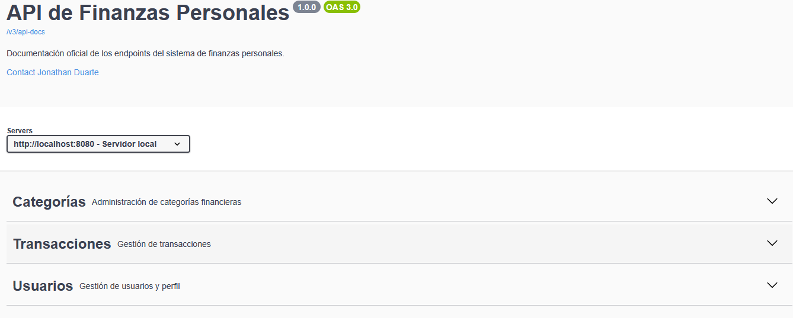
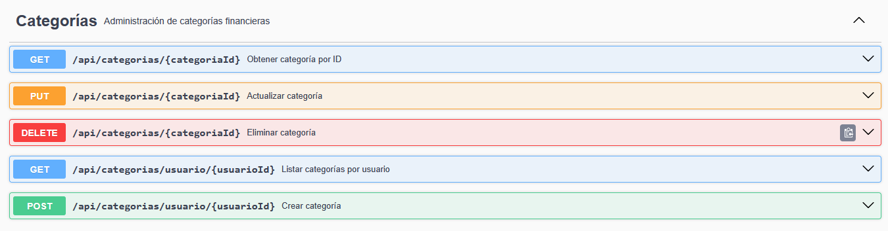
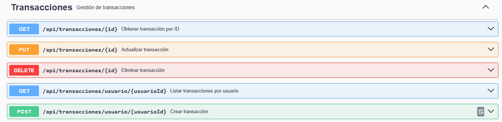
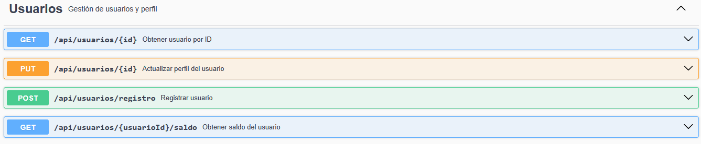

# API de Finanzas Personales  
Sistema backend desarrollado en **Spring Boot** para la gestión de finanzas personales, permitiendo administrar usuarios, categorías y transacciones, con documentación generada mediante **Swagger / OpenAPI 3.0**.

---

## 🚀 Características principales

- Gestión completa de usuarios (registro, perfil, saldo)
- CRUD de categorías financieras
- CRUD de transacciones (ingresos y gastos)
- Cálculo automático de saldo (ingresos − gastos)
- Documentación interactiva con Swagger UI
- Arquitectura limpia basada en DTOs, Servicios, Controladores y Mappers (MapStruct)
- Base de datos PostgreSQL

---

## 🛠️ Tecnologías utilizadas

- **Java 17**
- **Spring Boot 3**
- **Spring Data JPA**
- **Spring Web**
- **Spring Validation**
- **MapStruct**
- **PostgreSQL**
- **Swagger / Springdoc OpenAPI**
- **Lombok**

---

## 📚 Documentación Swagger

La API cuenta con documentación interactiva disponible en tiempo de ejecución:

👉 **http://localhost:8080/swagger-ui/index.html**

### 📌 Vista general de módulos

---

## 🗂️ Endpoints por módulo

### 📁 **Categorías**
CRUD de categorías financieras.

---

### 📁 **Transacciones**
CRUD de ingresos y gastos asociados a cada usuario.

---

### 📁 **Usuarios**
Gestión de usuarios, perfil y saldo actual.

